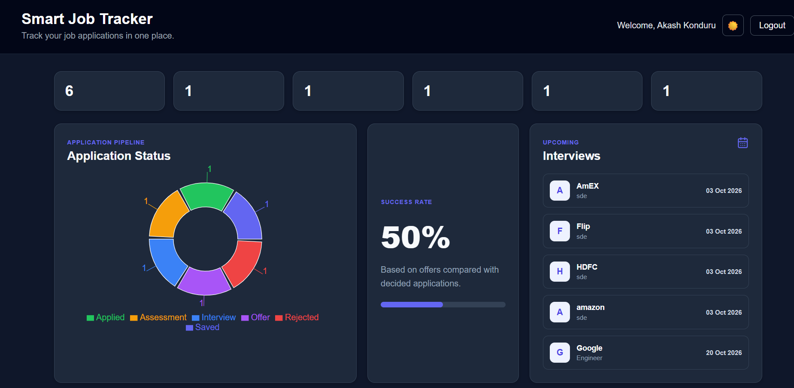
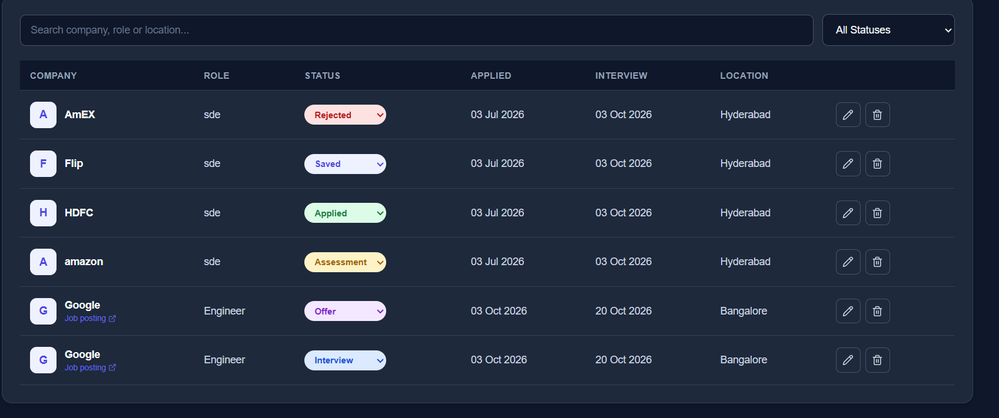
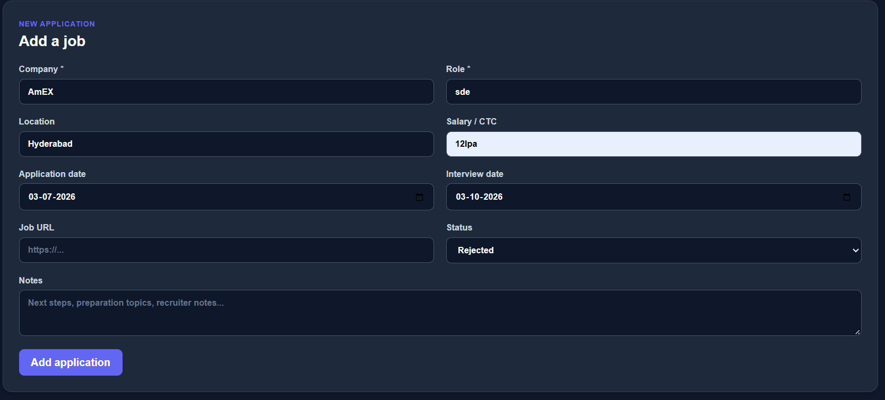
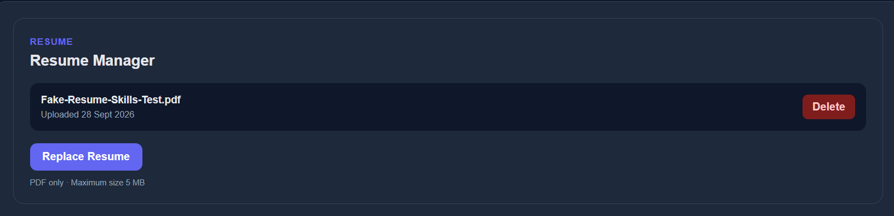
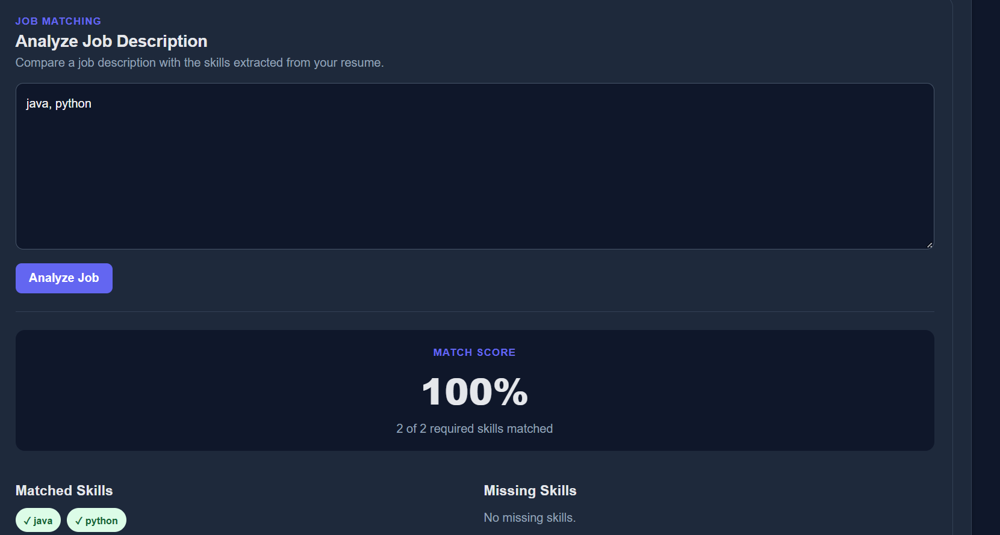
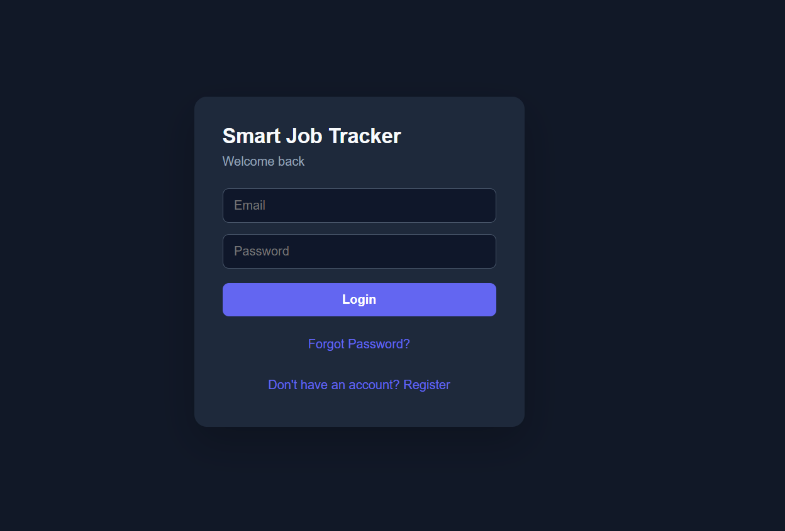

# Smart Job Application Tracker

A full-stack web application for managing job applications, tracking application progress, analyzing job descriptions against resume skills, and securely managing user accounts.

## Live Demo

- Frontend: https://smart-job-tracker-steel.vercel.app
- Backend API: https://smart-job-tracker-api-h89q.onrender.com
- GitHub: https://github.com/akashkonduru2-cell/smart-job-tracker

## Features

### Authentication

- User registration and login
- Password hashing using bcrypt
- JWT-based authentication
- Protected API routes
- Forgot password functionality
- Secure password reset using time-limited tokens
- Password reset emails using Resend

### Job Application Management

- Add job applications
- Edit applications
- Delete applications
- Track application status
- Store company, role, location and salary
- Store job posting URLs
- Add notes
- Track application and interview dates

### Application Tracking

Supported statuses:

- Saved
- Applied
- Assessment
- Interview
- Offer
- Rejected

### Dashboard & Analytics

- Total applications
- Saved applications
- Applied applications
- Assessments
- Interviews
- Offers
- Rejections
- Success rate
- Application status visualization
- Upcoming interviews

### Resume Management

- Upload PDF resume
- Resume text extraction
- Store extracted resume information
- View uploaded resume information
- Delete resume

### Job Description Matching

Paste a job description and compare it against skills extracted from your resume.

The matcher provides:

- Match percentage
- Matched skills
- Missing skills
- Required skills

### Search & Filtering

- Search applications by company
- Search by role
- Search by location
- Filter by application status

### UI

- Responsive React interface
- Dark mode
- Dashboard-based layout
- Interactive charts

## Screenshots

### Dashboard



### Applications



### Add Application



### Resume Manager



### Job Matching



### Login



## Tech Stack

### Frontend

- React.js
- Vite
- Recharts
- Lucide React
- JavaScript
- CSS

### Backend

- Node.js
- Express.js
- JWT
- bcryptjs
- Multer
- pdf-parse
- Resend

### Database

- MongoDB
- MongoDB Atlas
- Mongoose

### Deployment

- Vercel — Frontend
- Render — Backend
- MongoDB Atlas — Database
- Resend — Password reset emails

## Architecture

```text
                         Smart Job Tracker
                                |
                +---------------+---------------+
                |                               |
             Frontend                        Backend
             React/Vite                    Node/Express
                |                               |
                |                         JWT Authentication
                |                               |
                |                    +----------+----------+
                |                    |                     |
                |               Applications          Resume
                |                    |                     |
                |                    |               PDF Parsing
                |                    |                     |
                |                    +----------+----------+
                |                               |
                |                         Job Matching
                |                               |
                +---------------+---------------+
                                |
                         MongoDB Atlas
```

## Project Structure

```text
smart-job-tracker/
│
├── backend/
│   ├── middleware/
│   ├── models/
│   ├── routes/
│   ├── utils/
│   ├── server.js
│   └── package.json
│
├── frontend/
│   ├── src/
│   │   ├── components/
│   │   ├── api.js
│   │   ├── App.jsx
│   │   └── main.jsx
│   ├── package.json
│   └── vercel.json
│
├── screenshots/
│   ├── login.png
│   ├── dashboard.png
│   ├── resume-manager.png
│   ├── job-matching.png
│   ├── add-application.png
│   └── applications.png
│
├── .gitignore
└── README.md
```

## Local Setup

### 1. Clone the repository

```bash
git clone https://github.com/akashkonduru2-cell/smart-job-tracker.git
cd smart-job-tracker
```

### 2. Install backend dependencies

```bash
cd backend
npm install
```

### 3. Create backend environment variables

Create a file:

```text
backend/.env
```

Add:

```env
PORT=5000
MONGODB_URI=your_mongodb_connection_string
JWT_SECRET=your_jwt_secret
RESEND_API_KEY=your_resend_api_key
```

### 4. Start the backend

```bash
npm start
```

Backend:

```text
http://localhost:5000
```

### 5. Install frontend dependencies

Open another terminal:

```bash
cd frontend
npm install
```

### 6. Create frontend environment variables

Create:

```text
frontend/.env
```

Add:

```env
VITE_API_URL=http://localhost:5000/api
```

### 7. Start the frontend

```bash
npm run dev
```

Frontend:

```text
http://localhost:5173
```

## API Endpoints

### Authentication

```text
POST /api/auth/register
POST /api/auth/login
POST /api/auth/forgot-password
POST /api/auth/reset-password
```

### Job Applications

```text
GET    /api/applications
GET    /api/applications/stats
POST   /api/applications
PUT    /api/applications/:id
DELETE /api/applications/:id
```

### Resume

```text
GET    /api/resume
POST   /api/resume/upload
DELETE /api/resume
```

### Job Matching

```text
POST /api/matching/analyze
```

### Health Check

```text
GET /api/health
```

## Security

- Passwords are hashed using bcrypt
- JWT authentication protects private API routes
- Users can access only their own job applications
- Resume endpoints require authentication
- Password reset tokens are securely hashed before storage
- Password reset tokens expire after 15 minutes
- Sensitive configuration is stored using environment variables
- `.env` files are excluded from Git

## Future Improvements

- Cloud storage for uploaded resumes
- Resume download and preview
- Email notifications for upcoming interviews
- Job application reminders
- Advanced resume-to-job matching
- AI-powered job recommendations
- Application activity history
- Job board integration

## Author

**K. Akash**

GitHub: https://github.com/akashkonduru2-cell